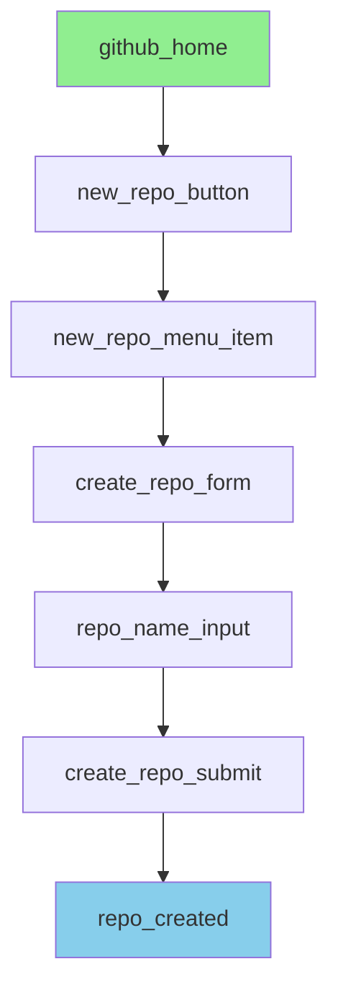

## Workflow: Create a New GitHub Repository

**Goal**: Create a new public or private repository on GitHub

**Starting Point**: https://github.com (user logged in)

**End State**: New repository created at https://github.com/{username}/{repo-name}

**Common Variations**:
- Creating with/without README
- Public vs Private repository
- Adding .gitignore and license

## Nodes

### Node: github_home
**Type**: page
**URL Pattern**: `^https://github\.com/?$`
**Description**: GitHub homepage when logged in

### Node: new_repo_button
**Type**: action
**Selector**: `[data-test-selector="global-create-menu-button"]`
**Description**: The "+" dropdown button in top navigation

### Node: new_repo_menu_item
**Type**: action
**Selector**: `[data-test-selector="global-create-menu"] a[href="/new"]`
**Description**: "New repository" option in dropdown menu

### Node: create_repo_form
**Type**: page
**URL Pattern**: `^https://github\.com/new$`
**Description**: Repository creation form page

### Node: repo_name_input
**Type**: action
**Selector**: `input[data-testid="repository-name-input"]`
**Description**: Repository name input field

### Node: create_repo_submit
**Type**: action
**Selector**: `button[type="submit"]:has-text("Create repository")`
**Description**: Final "Create repository" button

### Node: repo_created
**Type**: page
**URL Pattern**: `^https://github\.com/[^/]+/[^/]+$`
**Description**: Newly created repository page

## Edges

### Edge: github_home → new_repo_button
**Action**: click
**Trigger Element**:
  - Selector: `[data-test-selector="global-create-menu-button"]`
  - Text: "+"
  - Attributes: `aria-label="Create new..."`

**Wait Conditions**:
  - Type: selector
  - Value: `[data-test-selector="global-create-menu"]`

**Success Indicators**: Dropdown menu becomes visible

**Failure Modes**:
  - Button not found → User may not be logged in
  - Menu doesn't open → Try clicking again after 500ms

### Edge: new_repo_button → new_repo_menu_item
**Action**: click
**Trigger Element**:
  - Selector: `[data-test-selector="global-create-menu"] a[href="/new"]`
  - Text: "New repository"

**Wait Conditions**:
  - Type: networkidle
  - Value: 2000ms

**Success Indicators**: URL changes to /new

### Edge: new_repo_menu_item → create_repo_form
**Action**: navigate
**Success Indicators**: Form page loads with repository name input visible

### Edge: create_repo_form → repo_name_input
**Action**: type
**Trigger Element**:
  - Selector: `input[data-testid="repository-name-input"]`

**Input Data**:
  - Field: `repository-name`
  - Type: text
  - Validation: Must be alphanumeric with hyphens/underscores, not start with hyphen
  - Example: "my-awesome-project"

**Success Indicators**:
  - Input value updates
  - Validation message shows availability status

**Failure Modes**:
  - Name already exists → Show error, agent must choose different name
  - Invalid characters → Remove invalid characters and retry

### Edge: repo_name_input → create_repo_submit
**Action**: click
**Trigger Element**:
  - Selector: `button[type="submit"]:has-text("Create repository")`
  - Text: "Create repository"

**Wait Conditions**:
  - Type: networkidle
  - Value: 3000ms

**Success Indicators**:
  - URL changes to new repository pattern
  - Repository page displays with quick setup section

**Failure Modes**:
  - Rate limit → Wait and retry after delay
  - Validation error → Check error message and fix input

### Edge: create_repo_submit → repo_created
**Action**: navigate
**Success Indicators**:
  - Repository page loads
  - Repository name appears in breadcrumb
  - Quick setup section is visible

## Workflow Graph

## Alternative Paths

### Path: with_readme_initialization
**Condition**: When user wants to initialize with README
**Nodes**: [create_repo_form, repo_name_input, add_readme_checkbox, create_repo_submit, repo_created]
**Probability**: 0.73

## Error Recovery

### Error: repository_name_taken
**Detection**: Error message appears below name input
**Recovery Steps**:
1. Clear current name input
2. Append timestamp or random suffix to attempted name
3. Retry submission

**Fallback**: Prompt user for alternative name

### Error: rate_limit_exceeded
**Detection**: 429 status or "You have exceeded a secondary rate limit" message
**Recovery Steps**:
1. Wait 60 seconds
2. Retry the create action
3. If fails again, wait 300 seconds

**Fallback**: Notify user to try again later

## Optimization Notes

**Bottlenecks**:
- Edge: create_repo_submit → repo_created (avg 3.2s wait time)

**Improvements**:
- Version 1.0.0: Initial workflow based on 45 successful sessions

**Confidence Scores**:
- Node repo_name_input: 0.98 (selector stable across all sessions)
- Edge create_repo_submit → repo_created: 0.96 (2 timeouts in 45 sessions)
- Node new_repo_button: 0.99 (highly stable selector)
