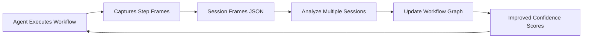

# Agent Workflow Learning Standards

## Overview

This document defines the standard formats and practices for AI agents to learn, document, and improve website navigation workflows. The system uses two complementary formats:

1. **Workflow Graph Format** (`.workflow.md`) - High-level navigation maps
2. **Step Frame Format** (`.frames.json`) - Detailed execution traces

## Purpose

These formats enable agents to:
- **Learn workflows** without broad exploration of websites
- **Share knowledge** between agent instances
- **Iteratively improve** navigation reliability
- **Recover from errors** using documented strategies
- **Optimize performance** based on empirical data

## File Structure

```
workflows/
├── {domain}/
│   ├── {workflow_name}/
│   │   ├── {domain}_{workflow_name}_v{version}.workflow.md    # Graph format
│   │   ├── session_{id}/
│   │   │   ├── {domain}_{workflow_name}_session_{id}_v{version}.frames.json
│   │   │   ├── screenshots/
│   │   │   │   └── frame_*.png
│   │   │   └── dom/
│   │   │       └── frame_*.html
│   │   └── session_{id2}/
│   │       └── ...
│   └── {workflow_name2}/
│       └── ...
└── {domain2}/
    └── ...
```

## Format Relationships

### Workflow Graph (Markdown)
- **Purpose**: Navigation roadmap
- **Content**: Nodes, edges, paths, error recovery
- **Audience**: Agents planning workflows
- **Update frequency**: After analyzing multiple sessions
- **Confidence scores**: Aggregated from session data

### Step Frames (JSON)
- **Purpose**: Execution evidence
- **Content**: Screenshots, DOM, actions, transcripts
- **Audience**: Agents learning from examples
- **Update frequency**: Real-time during execution
- **Confidence scores**: Per-action, per-session

### Data Flow



## Agent Responsibilities

### 1. Recording Sessions

When executing a workflow, agents MUST:

1. **Create session directory**
   ```bash
   workflows/{domain}/{workflow}/session_{uuid}/
   ```

2. **Capture frames** before and after each action
   - Screenshot (PNG format)
   - DOM snapshot (HTML)
   - Interactive elements list
   - Action metadata
   - Transcript

3. **Record metadata**
   - Start/end URLs
   - Total duration
   - Success/failure status
   - Errors encountered

4. **Generate session JSON** with all frames

### 2. Learning from Sessions

After completing sessions, agents SHOULD:

1. **Analyze selector stability**
   ```
   stability_score = successful_uses / total_attempts
   ```

2. **Identify reliable patterns**
   - Which selectors never break
   - Which actions always succeed
   - Common failure modes

3. **Extract alternative paths**
   - Different ways to achieve same goal
   - Conditional branches observed

4. **Document error recovery**
   - What errors occurred
   - How they were resolved
   - Fallback strategies

### 3. Updating Workflow Graphs

When improving workflow knowledge, agents MUST:

1. **Version appropriately**
   - Patch (1.0.x): Bug fixes, selector updates
   - Minor (1.x.0): New alternative paths
   - Major (x.0.0): Breaking workflow changes

2. **Update confidence scores**
   - Recalculate based on new session data
   - Weight by number of sessions tested

3. **Add learned insights**
   - Document what changed
   - Explain why changes improve reliability

4. **Merge knowledge** from multiple agents
   - Combine alternative selectors
   - Average confidence scores (weighted)
   - Preserve best error recovery strategies

### 4. Executing Workflows

When following a workflow, agents SHOULD:

1. **Read workflow graph first**
   - Understand full path
   - Check prerequisites
   - Note common failure modes

2. **Follow highest-confidence path**
   - Use selectors with highest stability scores
   - Implement recommended wait conditions

3. **Monitor for deviations**
   - Detect when actual page differs from expected
   - Fall back to alternative selectors

4. **Record session** for future learning
   - Even successful runs provide data
   - Failed runs are especially valuable

## Best Practices

### Selector Strategy

Prefer selectors in this order:
1. `data-testid` / `data-test-selector` attributes (most stable)
2. Semantic ARIA labels
3. Unique IDs (if stable)
4. Combination selectors (role + text)
5. Class-based selectors (least stable)

Always document **alternative selectors** for fallback.

### Privacy & Security

- **NEVER** store actual sensitive data
- **ALWAYS** mask passwords, tokens, keys
- **REDACT** sensitive info from screenshots
- Set `masked: true` for sensitive inputs
- Use placeholder: `"***MASKED***"`

### Performance Optimization

- **Deduplicate** identical screenshots (use hashes)
- **Compress** PNG screenshots (level 6)
- **Store DOM diffs** instead of full HTML when possible
- **Archive old sessions** after 30 days (lower quality)

### Confidence Thresholds

Agents should use these guidelines:

- **0.95+**: Highly reliable, use as primary
- **0.85-0.94**: Generally reliable, good fallback
- **0.70-0.84**: Moderately reliable, use with caution
- **Below 0.70**: Unstable, consider alternatives

When selector confidence < 0.70, agent should:
1. Try alternative selectors
2. Use visual element detection
3. Report selector as needing update

## Workflow Lifecycle

### Phase 1: Discovery
- Agent explores website manually
- Records first session with step frames
- Creates initial workflow graph (v0.1.0)
- Confidence scores start at 0.5

### Phase 2: Validation
- Execute workflow 10-20 times
- Update confidence scores based on results
- Identify and document failure modes
- Release v1.0.0 when success rate > 90%

### Phase 3: Optimization
- Discover alternative paths
- Optimize wait conditions
- Reduce average duration
- Increment minor versions

### Phase 4: Maintenance
- Monitor for website changes
- Update broken selectors
- Adapt to UI redesigns
- Maintain success rate > 85%

### Phase 5: Deprecation
- Website fundamentally changes
- Workflow no longer achievable
- Mark as deprecated, create new workflow
- Preserve old versions for reference

## Merging Agent Knowledge

When multiple agents have learned the same workflow:

### 1. Compare Versions
```python
if agent_A.success_rate > agent_B.success_rate:
    base_workflow = agent_A.workflow
else:
    base_workflow = agent_B.workflow
```

### 2. Merge Selectors
```python
# Combine alternative selectors
all_selectors = agent_A.selectors + agent_B.selectors

# Calculate weighted confidence
for selector in all_selectors:
    total_attempts = selector.attempts_A + selector.attempts_B
    total_successes = selector.successes_A + selector.successes_B
    selector.confidence = total_successes / total_attempts
```

### 3. Combine Insights
- Merge error recovery strategies
- Add all observed alternative paths
- Combine optimization notes
- Update tested_sessions count

### 4. Increment Version
- Major version if workflow structure changed
- Minor version if new paths added
- Patch version if just confidence updates

## Query Examples

Agents can analyze frame data to answer questions:

### "What's the most reliable way to click login?"

```sql
-- Pseudo-query on frames data
SELECT
    action.target.selector,
    AVG(verification.action_succeeded) as success_rate,
    AVG(learning.selector_stability) as stability,
    COUNT(*) as sample_size
FROM frames
WHERE action.intent LIKE '%login%'
  AND action.type = 'click'
GROUP BY action.target.selector
ORDER BY (success_rate * stability * LOG(sample_size)) DESC
LIMIT 1
```

### "How long does checkout usually take?"

```sql
SELECT
    AVG(metadata.total_duration_ms) as avg_duration,
    PERCENTILE(metadata.total_duration_ms, 0.95) as p95_duration
FROM sessions
WHERE metadata.workflow_name = 'checkout'
  AND metadata.success = true
```

### "What are common errors during payment?"

```sql
SELECT
    verification.failure_indicators,
    COUNT(*) as occurrences,
    ARRAY_AGG(DISTINCT summary.recovery_actions) as recoveries
FROM frames
WHERE workflow_name = 'payment'
  AND verification.action_succeeded = false
GROUP BY verification.failure_indicators
ORDER BY occurrences DESC
```

## Integration with Agent Systems

### Reading Workflow Before Execution

```python
def execute_workflow(domain, workflow_name):
    # 1. Load workflow graph
    workflow = load_workflow_graph(f"{domain}_{workflow_name}.workflow.md")

    # 2. Check prerequisites
    if not meets_prerequisites(workflow.prerequisites):
        return Error("Prerequisites not met")

    # 3. Plan path
    path = select_highest_confidence_path(workflow)

    # 4. Execute with session recording
    session = create_session()
    for edge in path:
        frame = capture_frame_before_action()
        result = execute_action(edge, use_best_selector(edge))
        frame = capture_frame_after_action()
        session.add_frame(frame)

        if not result.success:
            recovery = workflow.get_error_recovery(result.error_type)
            result = attempt_recovery(recovery)

    # 5. Save session
    save_session(session)

    # 6. Update workflow if needed
    if should_update_workflow(session):
        update_workflow_graph(workflow, session)
```

### Learning from New Session

```python
def learn_from_session(session):
    workflow = load_workflow_graph(session.workflow)

    # Update confidence scores
    for frame in session.frames:
        selector = frame.action.target.selector
        success = frame.verification.action_succeeded

        workflow.update_selector_confidence(selector, success)

    # Extract new patterns
    if session.discovered_new_path():
        workflow.add_alternative_path(session.extract_path())

    # Update error recovery
    if session.had_errors():
        for error in session.errors:
            if error.was_recovered():
                workflow.add_recovery_strategy(error.type, error.recovery)

    # Save updated workflow
    workflow.increment_version()
    workflow.tested_sessions += 1
    save_workflow_graph(workflow)
```

## Version Control Integration

Workflows and sessions should be version-controlled:

```bash
# Directory structure in git
workflows/
├── .gitignore           # Ignore large screenshot files
├── README.md            # Workflow catalog
├── github.com/
│   └── create_repository/
│       ├── github.com_create_repository_v1.workflow.md
│       ├── github.com_create_repository_v2.workflow.md
│       └── sessions.jsonl   # Compressed session metadata only
└── gmail.com/
    └── ...
```

### `.gitignore` for Workflows

```gitignore
# Ignore large binary files
*.png
*.jpg
*.jpeg
*.webp

# Ignore full DOM snapshots
dom/*.html

# Keep workflow graphs and session metadata
!*.workflow.md
!sessions.jsonl
!*.frames.json
```

### Session Metadata Archive

Instead of storing full sessions in git, compress to metadata:

```jsonl
{"session_id": "abc123", "workflow": "create_repository", "success": true, "duration_ms": 12450, "timestamp": "2025-10-09T14:32:15Z"}
{"session_id": "def456", "workflow": "create_repository", "success": false, "duration_ms": 8930, "timestamp": "2025-10-09T15:12:33Z", "error": "rate_limit"}
```

Full sessions with screenshots stored in object storage (S3, etc).

## Metrics & Monitoring

Agents should track and report:

### Workflow Health Metrics

```yaml
workflow: github.com/create_repository
version: 2.1.0
health:
  success_rate: 0.96
  avg_duration_seconds: 12.3
  p95_duration_seconds: 18.7
  total_sessions: 342
  failed_sessions: 14
  last_success: 2025-10-09T16:45:00Z
  last_failure: 2025-10-09T12:30:00Z
  common_failures:
    - type: rate_limit
      count: 8
      recovery_rate: 1.0
    - type: selector_not_found
      count: 6
      recovery_rate: 0.67
```

### Agent Learning Progress

```yaml
agent: agent-claude-001
learning_stats:
  workflows_learned: 23
  total_sessions: 1547
  success_rate: 0.94
  discoveries:
    new_workflows: 5
    new_paths: 12
    new_recoveries: 8
  contributions:
    workflow_updates: 45
    confidence_improvements: 234
```

## Future Enhancements

### Planned Improvements

1. **Visual element detection**
   - When selectors fail, use screenshots
   - ML-based element recognition
   - Position-based fallbacks

2. **Cross-workflow learning**
   - Recognize similar patterns across sites
   - Transfer knowledge between domains
   - Learn common UI patterns (login, checkout, etc.)

3. **Collaborative learning**
   - Multiple agents update same workflow
   - Real-time confidence updates
   - Conflict resolution strategies

4. **Automated workflow discovery**
   - Agent explores site autonomously
   - Discovers common user workflows
   - Generates initial workflow graphs

5. **Workflow verification**
   - Automated testing of workflows
   - Detect when websites change
   - Alert when success rate drops

## See Also

- [workflow_graph_schema.md](./workflow_graph_schema.md) - Detailed workflow graph format
- [step_frame_schema.md](./step_frame_schema.md) - Detailed step frame format
- [../examples/workflows/](../examples/workflows/) - Example workflows and sessions

---

## Quick Start for Agents

### To Execute a Workflow:

1. Read `{domain}_{workflow}_v{latest}.workflow.md`
2. Check prerequisites
3. Follow highest-confidence path
4. Record session to `.frames.json`
5. Update workflow if you learned something

### To Create a New Workflow:

1. Execute task manually while recording
2. Generate `.frames.json` from session
3. Analyze frames to create `.workflow.md`
4. Set initial version to 0.1.0
5. Mark confidence scores as 0.5 (unproven)
6. Execute 10+ times to validate
7. Release 1.0.0 when success rate > 90%

### To Improve a Workflow:

1. Load existing `.workflow.md`
2. Execute and record session
3. Calculate new confidence scores
4. Update selectors if failures occurred
5. Add alternative paths if discovered
6. Document new error recoveries
7. Increment version appropriately
8. Commit changes with explanation
