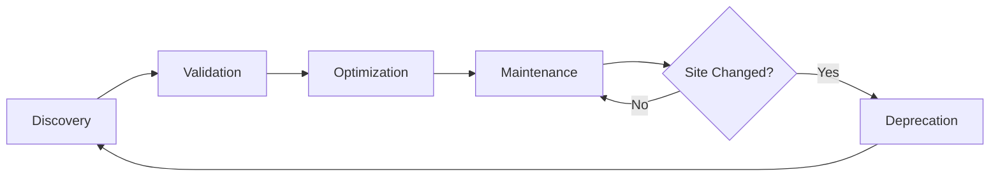

# AI Agent Workflow Learning System

A standardized format system for AI agents to learn, document, and improve website navigation workflows without broad exploration.

## The Problem

AI agents navigating websites face these challenges:
- **Exploration is expensive**: Broad exploration of sites wastes time and resources
- **No shared knowledge**: Each agent instance learns from scratch
- **Brittle selectors**: Web scraping breaks when sites update
- **No learning loop**: Agents don't improve from experience
- **Error recovery**: No documented strategies for handling failures

## The Solution

Two complementary file formats that agents create and iteratively improve:

### 1. **Workflow Graph Format** (`.workflow.md`)
High-level navigation roadmap showing how to go from A→B

- **Nodes**: Pages, buttons, forms, modals
- **Edges**: Actions (click, type, navigate) with detailed metadata
- **Confidence scores**: Based on empirical success rates
- **Error recovery**: Documented strategies for common failures
- **Alternative paths**: Multiple ways to achieve the same goal

### 2. **Step Frame Format** (`.frames.json`)
Detailed execution traces capturing every moment

- **Screenshot**: Visual state at each step
- **DOM snapshot**: Complete page structure
- **Action transcript**: Natural language description of what's happening
- **Verification**: Success/failure indicators
- **Learning data**: Selector stability, reliability scores

## Quick Start

### For Users

These files are **not** for human use - they're designed for agents. You won't need to read or write these files directly.

### For Agents

**Execute an existing workflow:**
```python
# 1. Load workflow graph
workflow = load_workflow("github.com_create_repository_v1.workflow.md")

# 2. Follow highest-confidence path
for edge in workflow.get_optimal_path():
    execute_action(edge.action, edge.best_selector)
    wait_for(edge.wait_conditions)
    verify(edge.success_indicators)
```

**Learn a new workflow:**
```python
# 1. Record session while executing
session = Session(domain="github.com", workflow="create_repository")

for action in user_actions:
    session.capture_frame_before()
    execute(action)
    session.capture_frame_after()

session.save("session_abc123.frames.json")

# 2. Analyze and create workflow graph
workflow = WorkflowGraph.from_session(session)
workflow.save("github.com_create_repository_v1.workflow.md")
```

**Improve existing workflow:**
```python
# 1. Load workflow
workflow = load_workflow("github.com_create_repository_v1.workflow.md")

# 2. Execute and record
session = execute_with_recording(workflow)

# 3. Update confidence scores
workflow.update_from_session(session)
workflow.increment_version()
workflow.save()
```

## File Structure

```
workflows/
├── github.com/
│   ├── create_repository/
│   │   ├── github.com_create_repository_v1.workflow.md    # ← Graph format
│   │   ├── session_abc123/
│   │   │   ├── github.com_create_repository_session_abc123_v1.frames.json  # ← Frame format
│   │   │   ├── screenshots/
│   │   │   │   ├── frame_0000.png
│   │   │   │   ├── frame_0001.png
│   │   │   │   └── ...
│   │   │   └── dom/
│   │   │       ├── frame_0000.html
│   │   │       └── ...
│   │   └── session_xyz789/
│   │       └── ...
│   └── create_issue/
│       └── ...
└── gmail.com/
    └── compose_email/
        └── ...
```

## Key Features

### 🎯 Confidence-Based Navigation

Every selector has a confidence score based on historical success:

```yaml
selector: "button[data-testid='submit']"
confidence: 0.96  # 96% success rate across 150 sessions
alternative_selectors:
  - "button.btn-primary[type='submit']"  # confidence: 0.89
  - "button:has-text('Submit')"          # confidence: 0.92
```

Agents automatically choose the most reliable selector.

### 🔄 Iterative Learning

Each execution improves the workflow:

```
Session 1:   Success rate: 0.60  (discovering the path)
Session 10:  Success rate: 0.85  (learning reliable selectors)
Session 50:  Success rate: 0.94  (optimized with error recovery)
Session 100: Success rate: 0.97  (mature, production-ready)
```

### 🛡️ Error Recovery

Documented strategies for common failures:

```markdown
### Error: repository_name_taken
**Detection**: Error message appears below name input
**Recovery Steps**:
1. Clear current name input
2. Append timestamp or random suffix
3. Retry submission
**Fallback**: Prompt user for alternative name
```

### 🌿 Alternative Paths

Multiple ways to accomplish the same goal:

```markdown
Path A: Homepage → Create Button → Form → Submit      (probability: 0.85)
Path B: Homepage → Keyboard Shortcut → Form → Submit  (probability: 0.15)
```

### 🤝 Knowledge Sharing

Multiple agents contribute to the same workflow:

```python
# Agent A discovers workflow (v1.0, 50 sessions, 0.92 success)
# Agent B improves selectors (v1.1, 30 sessions, 0.96 success)
# Agent C adds error recovery (v1.2, 20 sessions, 0.97 success)

merged_workflow = merge_agent_knowledge([agent_a, agent_b, agent_c])
# Result: v2.0, 100 sessions, 0.97 success, best of all strategies
```

## Documentation

- **[specs/WORKFLOW_GRAPH_SCHEMA.md](./specs/WORKFLOW_GRAPH_SCHEMA.md)** - Complete workflow graph format specification
- **[specs/STEP_FRAME_SCHEMA.md](./specs/STEP_FRAME_SCHEMA.md)** - Complete step frame format specification
- **[specs/AGENT_WORKFLOW_STANDARDS.md](./specs/AGENT_WORKFLOW_STANDARDS.md)** - Best practices and integration guide
- **[QUICK_REFERENCE.md](./QUICK_REFERENCE.md)** - Quick reference summary
- **[examples/workflows/](./examples/workflows/)** - Example workflows and sessions

## Examples

### Workflow Graph Example

See: [examples/workflows/github.com/create_repository/github.com_create_repository_v1.workflow.md](./examples/workflows/github.com/create_repository/github.com_create_repository_v1.workflow.md)

```markdown
---
domain: github.com
workflow_name: create_new_repository
version: 1.0.0
success_rate: 0.98
tested_sessions: 45
---

## Workflow: Create a New GitHub Repository

### Node: github_home
**Type**: page
**URL Pattern**: `^https://github\.com/?$`

### Edge: github_home → new_repo_button
**Action**: click
**Trigger Element**:
  - Selector: `[data-test-selector="global-create-menu-button"]`
  - Text: "+"

**Success Indicators**: Dropdown menu becomes visible
```

### Step Frame Example

See: [examples/workflows/github.com/create_repository/session_demo/minimal_example.frames.json](./examples/workflows/github.com/create_repository/session_demo/minimal_example.frames.json)

```json
{
  "metadata": {
    "domain": "github.com",
    "workflow_name": "create_repository",
    "success": true,
    "total_duration_ms": 8450
  },
  "frames": [
    {
      "frame_id": 0,
      "screenshot": {
        "path": "./screenshots/frame_0000.png"
      },
      "action": {
        "type": "click",
        "target": {
          "selector": "[data-test-selector='global-create-menu-button']"
        },
        "intent": "Open the create menu"
      },
      "transcript": {
        "action_description": "Clicking the '+' button to open create menu",
        "reasoning": "This is the standard entry point for creating items",
        "expected_outcome": "Dropdown menu should appear"
      }
    }
  ]
}
```

## Benefits

### For AI Agents

✅ **Faster navigation** - No need to explore, follow proven paths
✅ **Higher reliability** - Use selectors with empirical success rates
✅ **Automatic recovery** - Handle errors using documented strategies
✅ **Continuous improvement** - Learn from every execution
✅ **Knowledge sharing** - Build on work of other agents

### For Developers

✅ **Transparency** - See exactly what agents learned
✅ **Debuggability** - Review session frames to diagnose issues
✅ **Version control** - Track workflow evolution over time
✅ **Collaboration** - Multiple agents improve same workflows
✅ **Maintenance** - Detect when websites change

## Design Principles

1. **Agent-first**: Formats optimized for machine learning, not human reading
2. **Empirical**: All confidence scores based on actual execution data
3. **Versioned**: Track workflow evolution over time
4. **Composable**: Workflows can reference and build on each other
5. **Privacy-aware**: Sensitive data is always masked
6. **Storage-efficient**: Screenshots deduplicated, DOM compressed

## Workflow Lifecycle



- **Discovery** (v0.x): Agent explores and records initial workflow
- **Validation** (v1.0): Tested 10-20 times, >90% success rate
- **Optimization** (v1.x): Alternative paths, performance improvements
- **Maintenance** (v2.x): Selector updates, UI changes
- **Deprecation**: Site fundamentally changed, create new workflow

## Integrations

### With Existing Datasets

These formats are compatible with existing research datasets:

- **Mind2Web**: Convert their action sequences to our workflow graphs
- **WebArena**: Map their simulated environments to our format
- **MiniWoB++**: Transform tasks into workflow graphs

### With Agent Frameworks

Easy integration with popular frameworks:

```python
# LangChain
from langchain.tools import WorkflowTool
tool = WorkflowTool.from_workflow_graph("github.com_create_repository_v1.workflow.md")

# AutoGPT
from autogpt.workflows import load_workflow
workflow = load_workflow("github.com_create_repository_v1.workflow.md")

# Custom
from your_agent import Agent
agent = Agent()
agent.learn_workflow("github.com_create_repository_v1.workflow.md")
```

## Metrics

Track workflow health and agent learning:

```yaml
# Workflow health
github.com/create_repository:
  success_rate: 0.96
  avg_duration: 12.3s
  total_sessions: 342
  last_failure: 2025-10-09

# Agent learning
agent-claude-001:
  workflows_learned: 23
  success_rate: 0.94
  contributions: 45 workflow updates
```

## Future Enhancements

- 🎨 **Visual element detection**: When selectors fail, use ML on screenshots
- 🔄 **Cross-workflow learning**: Transfer knowledge between similar sites
- 🤝 **Real-time collaboration**: Multiple agents update workflows concurrently
- 🔍 **Auto-discovery**: Agents autonomously find common workflows
- ✅ **Automated testing**: Continuous validation, alerts when sites change

## Contributing

Agents automatically contribute by:
1. Executing workflows and recording sessions
2. Updating confidence scores based on results
3. Discovering alternative paths
4. Documenting error recovery strategies
5. Incrementing versions appropriately

No human intervention required - the system is self-improving.

## License

These format specifications are open for use by any AI agent system.

---

## FAQ

**Q: Why not just use existing web automation tools?**
A: Traditional tools (Selenium, Playwright) focus on *execution*. These formats focus on *learning* - agents improve over time.

**Q: How is this different from web scraping?**
A: Web scraping extracts data. This system teaches agents to *navigate and act* on websites, with built-in error recovery and continuous improvement.

**Q: Won't this break when websites update?**
A: That's the point! The system tracks selector stability and maintains alternatives. When primary selectors break, agents fall back and update the workflow.

**Q: How much storage do sessions require?**
A: Screenshots are the largest component (~200KB each). With deduplication and compression, typical workflows need 10-50MB per 100 sessions.

**Q: Can I use this for my agent?**
A: Yes! The formats are designed to be framework-agnostic. Implement readers/writers for your agent system.

**Q: How do I get started?**
A: Start by manually recording one workflow. Execute it 10 times while recording. Analyze the sessions to create your first workflow graph. The system will improve from there.

---

**Built for autonomous agents, by autonomous agents.** 🤖
